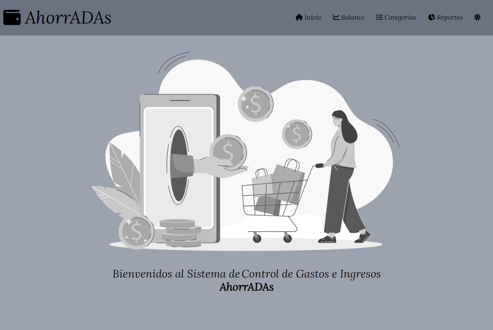

<!-- ===========================================================
                            PRESENTACIÓN 
     =========================================================== -->

   

***

   

***

 ## Tabla de Contenidos:
 
- [AhorrADAs](#ahorradas)
- [Tecnologías](#tecnologías)
- [Construcción](#construcción)
- [Menús](#menus)
- [Mobile](#mobile)
- [Contáctanos](#contáctanos)

---
 

<!-- ==================================================
                         CONTENIDO 
     ================================================== -->

## *AhorrADAs*

[:top:](#tabla-de-contenidos)  

> Las aplicaciones web, comúnmente conocidas como apps, se han convertido en una parte esencial de nuestra vida cotidiana. Desde simplificar tareas diarias hasta ofrecer entretenimiento.  
La app `AhorrADAs` es una app web, que permite que cualquier usuario pueda ..... . 
La app AhorrADAs permite añadir ......

imagen

   

La app `AhorrADAs`, fue diseñada de tal manera que puede ser utilizada en diferentes dispositivos, lo que implica un correcto diseño responsive. 

imagen

   

 

Fue desarrollado como Trabajo Final del "Módulo 3 - JavaScript", de la capacitación de `"Desarrollo Frontend"` dictado por [ADA ITW](https://www.linkedin.com/school/ada-itw/), y se encuentra incluido en nuestros `Portfolios`, de tal manera de reflejar el grado de avance, apropiación y uso de los conocimiento adquiridos y asimilados durante la capacitación.

> [!NOTE]
> Visite nuestros portafolios: [PORTFOLIO MAGUI](https://maguibrollo.github.io/ADA_Portafolio_mod01_tf/)  -  [PORTFOLIO LUCÍA]().

 

## *Tecnologías*
[:top:](#tabla-de-contenidos)  
La app AhorrADAs fue desarrollada utilizando las siguientes tecnologías:  

|   |    |  |  
| :---: | :---: | :---: |
|Lenguaje de marcado de hipertexto. Consiste en marcas basado en etiquetas que otorgan la estructura básica de la app.| Hojas de estilo en cascada. Son las declaraciones que otorgan estilos visuales al HTML.  | Lenguaje de programación. Otorga interactividad a las distintas secciones que conforman la app.|

 

## *Construcción*
[:top:](#tabla-de-contenidos)  
La app AhorrADAs, presenta una pantalla principal que les da la bienvenida, y les permite cambiar de menú, para poder recorrer todas las opciones de la app. Los menús que puede visitar son: [Inicio](#inicio), [Balance](#balance), [Categorías](#categorías), [Reportes](#reportes),   además de poder intercambiar entre `Modo claro` y `Modo Oscuro`. 
La visualización se realiza por defecto en el Modo que tenga seleccionado como tema en su sitema operativo, pero puede cambiar entre `Modo Claro` y `Modo Oscuro` y este cambio pemranecerá.
 

|MODO OSCURO| MODO CLARO|
|    :---:  |   :---:  |
|| |

---

## *Menús*
[:top:](#tabla-de-contenidos)  

- [Inicio](#inicio)
- [Balance](#balance)
- [Categorías](#categorias)

#### Inicio
[:top:](#menús)  
Al abrir la app, si el tamaño de la pantalla del dispositivo utilizado, es menor a 600px, se verá como tamaño mobile............  

---

#### Balance
[:top:](#menús)

imagen/gif

   

Mediante el panel de imagen se podrá editar:
- Origen: ....
-  Fondo: ......
- Filtros:......

 

> [!NOTE]
> Si se minimiza el tamaño de la ventana, horizontalmente, el apartado `Operaciones` se visualizará en la parte inferior (ver [Mobile](#mobile)).

---

#### Categorías
[:top:](#menús)

imagen/gif

   

Mediante el menú ... se podrá ....:
-  xxxxx .....
- zzzzzz: ..... .
- yyyyy

 
---

#### Reportes
[:top:](#menús)

imagen/gif

   

Mediante este menú se podrá....:

 

   

 

   

 

---

## *Mobile:*
[:top:](#tabla-de-contenidos)  
Todas los menús explicados anteriormente, se encuentran disponibles para dispositivos móviles:

|Modo Oscuro| Modo Claro|
|:---:|:---:|
|||

 

|Menú | Menú |
|:---:|:---:|
|||

 

 imagenes

|Pantalla Horizontal| 
|:---:|
||

| Edición Horizontal|
|:---:|
||

 

---

## *Contáctanos:*
[:top:](#tabla-de-contenidos)  

 

---

